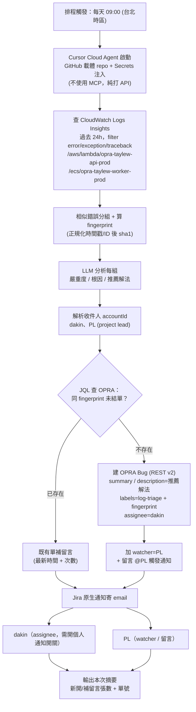

# Ops-Automations
CloudWatch 每日錯誤分流 → OPRA 開單

```mermaid
flowchart TD
    cron["排程觸發：每天 09:00 (台北時區)"] --> agent["Cursor Cloud Agent 啟動<br/>GitHub 載體 repo + Secrets 注入<br/>(不使用 MCP，純打 API)"]
    agent --> query["查 CloudWatch Logs Insights<br/>過去 24h，filter error/exception/traceback<br/>/aws/lambda/opra-taylew-api-prod<br/>/ecs/opra-taylew-worker-prod"]
    query --> group["相似錯誤分組 + 算 fingerprint<br/>(正規化時間戳/ID 後 sha1)"]
    group --> llm["LLM 分析每組<br/>嚴重度 / 根因 / 推薦解法"]
    llm --> resolve["解析收件人 accountId<br/>dakin、PL (project lead)"]
    resolve --> dedupe{"JQL 查 OPRA：<br/>同 fingerprint 未結單？"}
    dedupe -->|"已存在"| comment["既有單補留言<br/>(最新時間 + 次數)"]
    dedupe -->|"不存在"| create["建 OPRA Bug (REST v2)<br/>summary / description=推薦解法<br/>labels=log-triage + fingerprint<br/>assignee=dakin"]
    create --> watcher["加 watcher=PL<br/>+ 留言 @PL 觸發通知"]
    comment --> notify["Jira 原生通知寄 email"]
    watcher --> notify
    notify --> mailDakin["dakin（assignee，需開個人通知開關）"]
    notify --> mailPL["PL（watcher / 留言）"]
    mailDakin --> summary["輸出本次摘要<br/>新開/補留言張數 + 單號"]
    mailPL --> summary
```
